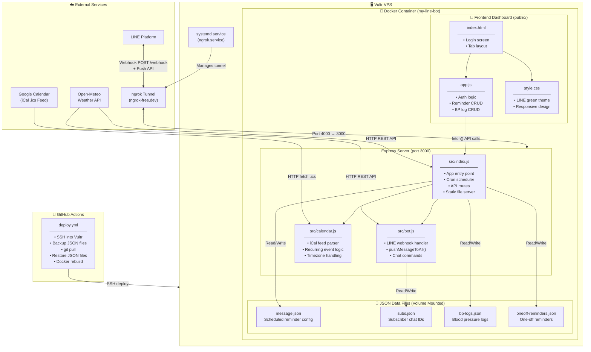
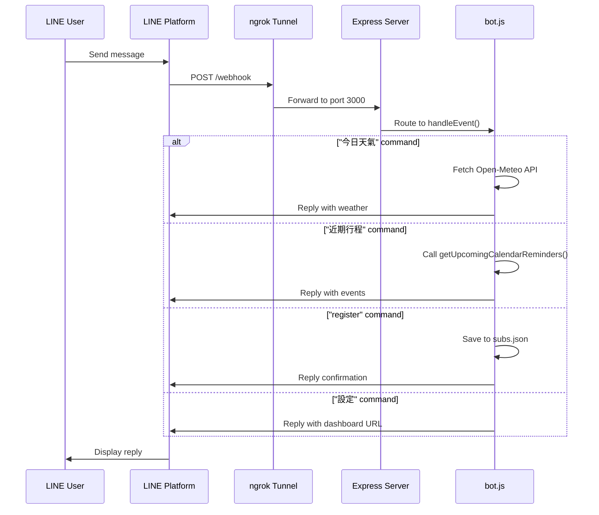
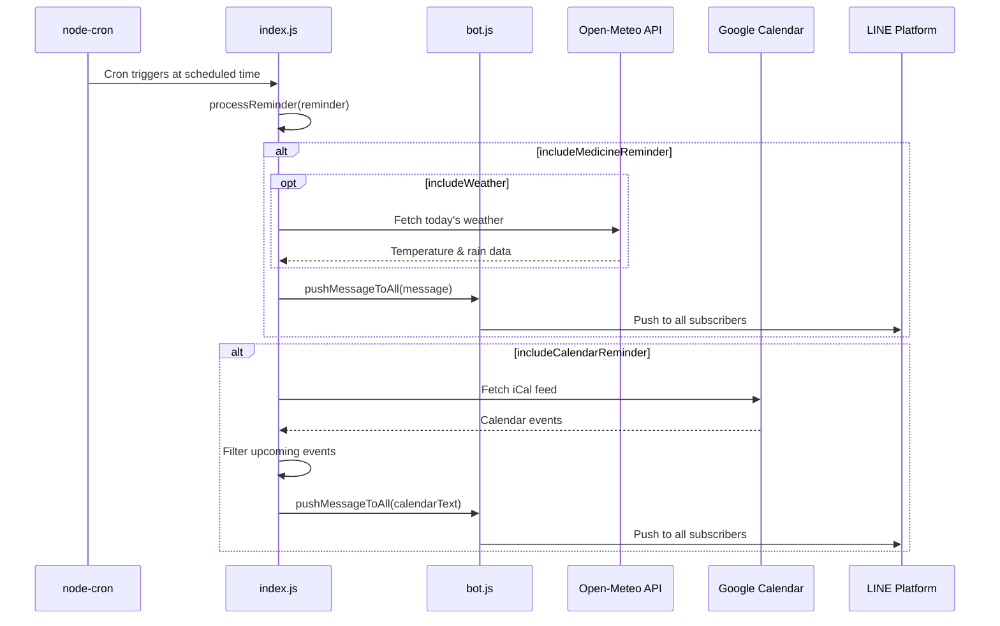
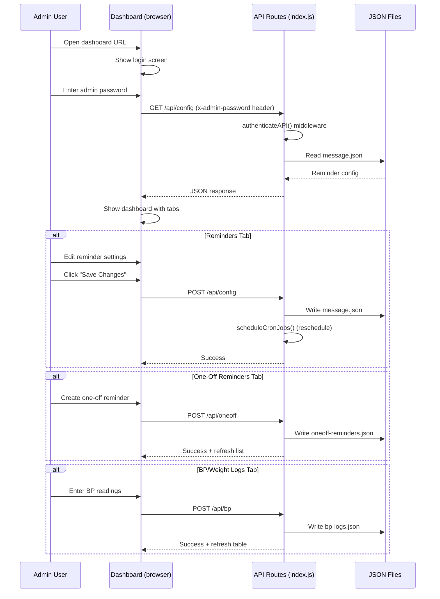
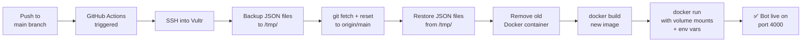

# LINE Bot Architecture Diagram

## System Overview



## Request Flow



## Scheduled Reminder Flow



## Dashboard UI Flow



## Deployment Pipeline



## File Structure

```
LINE-Notify/
├── src/
│   ├── index.js          # Express server, cron jobs, API routes
│   ├── bot.js            # LINE webhook handler, push messaging
│   └── calendar.js       # Google Calendar iCal feed parser
├── public/
│   ├── index.html        # Dashboard HTML (login + tabs)
│   ├── app.js            # Dashboard frontend logic
│   └── style.css         # LINE green themed styles
├── .github/
│   └── workflows/
│       └── deploy.yml    # Auto-deploy to Vultr via SSH
├── message.json          # Reminder schedules config (volume mounted)
├── subs.json             # Subscriber IDs (volume mounted)
├── bp-logs.json          # Blood pressure logs (volume mounted)
├── oneoff-reminders.json # One-off reminders (volume mounted)
├── Dockerfile            # Node 20 Alpine container
├── package.json          # Dependencies & scripts
└── .env                  # Local env vars (not deployed)
```
